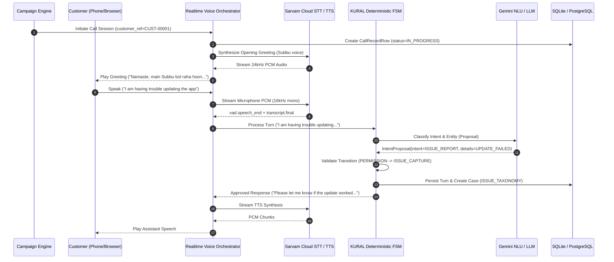
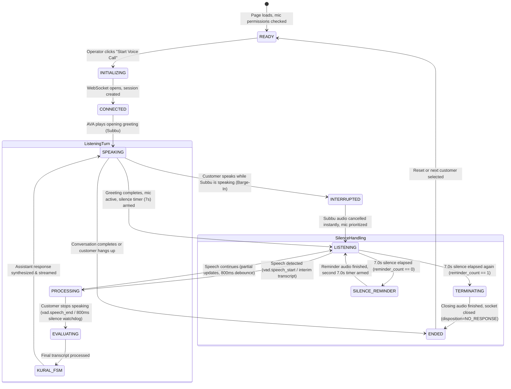
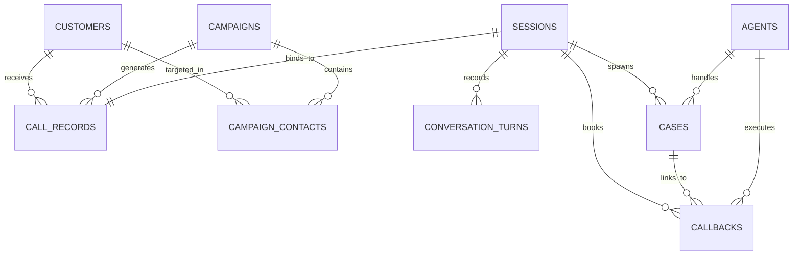

# AVA / KURAL Platform — Complete A-to-Z Architecture Audit and Claude Redesign Handover

**Document Version:** 1.0.0  
**Date:** October 10, 2026  
**Repository:** [https://github.com/vnkrthk08/AI-BANKING-AGENT](https://github.com/vnkrthk08/AI-BANKING-AGENT)  
**Target Audience:** Claude 3.7 / Opus / Sonnet, Product Designers, Principal Full-Stack Engineers, AI Voice Engineers  
**Current Active Branch:** `phase4-production-recovery`  
**Current Verified Commit:** `fb99a26`  
**Phase 3 Immutable Frozen Tag:** `phase3-accepted-frozen` (peeled commit: `59edf51`)  
**Backend Test Baseline:** 236/236 passing tests (`pytest tests/ -v`)  
**Frontend Build Baseline:** 0 TypeScript errors (`npm run build` in `frontend/`)  

---

## 1. Executive Summary & Product Overview

### 1.1 What the Product Is
**KURAL AVA** is an enterprise-grade, voice-orchestrated AI banking operations platform purpose-built for high-volume automated customer outreach, account assistance, mobile application adoption, and governed service escalation. 

Originally engineered for Indian retail banking operations (demonstrated under the fictional entity **Town Bank**), the system combines:
1. **Low-Latency Streaming Voice Telephony:** Sub-800ms interactive voice pipeline featuring streaming Speech-to-Text (STT via Sarvam AI Saaras v2 / WebSockets), real-time Large Language Model intent understanding (Google Gemini 2.5 Flash / Groq Llama 3.3 / Qwen), and low-latency neural Text-to-Speech (TTS via Sarvam Bulbul v3 / PCM streaming).
2. **Deterministic Finite State Machine (FSM):** A mathematically bounded conversational authority (**KURAL**) that enforces compliance, state transitions, closed-world banking policies, Indian banking regulations (RBI calling hours, no-Sunday-calls rule), and regex-level zero-leakage security interception (preventing OTP, MPIN, CVV, and Aadhaar exposure).
3. **Multi-Role Operations Dashboard:** A centralized banking operations workspace allowing Operations Managers, Call Center Supervisors, Human Agents, and Compliance Auditors to monitor live calls, manage outreach campaigns, resolve technical support escalations, manage scheduled callbacks, and review cryptographic audit trails.

### 1.2 Core Architectural Invariant: "AI Understands; Deterministic Rules Decide"
In regulated banking environments, autonomous LLMs must **never** be permitted to hallucinate loan rates, promise unapproved transactions, skip required regulatory disclosures, or invent conversational turns. 

In KURAL AVA:
- The **LLM** acts strictly as an **NLU / Semantic Extraction Layer**. It extracts user intent, parameters, and entities from customer speech.
- The **KURAL FSM Engine** acts as the **Sole Authority**. It validates whether the proposed transition is mathematically permissible within the current state, checks calling policies, inspects input for credential compromise, and selects the deterministic, pre-approved banking response text.

### 1.3 Who Uses KURAL AVA (User Personas & Roles)

The platform implements 4 primary operational roles defined in [`frontend/src/config/permissions.ts`](file:///c:/Users/venka/Desktop/KURAL%20AVA/frontend/src/config/permissions.ts) and [`kural/security/rbac.py`](file:///c:/Users/venka/Desktop/KURAL%20AVA/kural/security/rbac.py):

| Role Identifier | Role Label | Primary Objective | Critical Tasks & Access |
| :--- | :--- | :--- | :--- |
| **`OPS_MANAGER`** | **Operations Manager** | Oversees branch & regional outreach performance, campaign pacing, and high-level conversion. | Executive overview, campaign creation/pacing, call history, SLA compliance, analytics, export CSV/PDF reports. |
| **`SUPERVISOR`** | **Call Center Supervisor** | Monitors live call queues, floor capacity, agent workloads, and escalating customer issues. | Team board, live call monitoring (barge-in/listen), agent workload rebalancing, case re-assignment. |
| **`AGENT`** | **Human Banking Agent** | Resolves customer tickets escalated from AI calls and conducts scheduled customer callbacks. | "My Work" queue, assigned customer cases, pending callbacks, call customer, resolve tickets. |
| **`COMPLIANCE`** | **Compliance Officer / Auditor** | Ensures adherence to DPDP Act 2023, RBI telephony rules, PII masking, and consent logging. | Consent logs, egress logs, immutable audit trail, DND scrub compliance, regulatory report scheduling. |
| **`SYSTEM_ADMIN`** *(Backend)* | **System Administrator** | Manages infrastructure, API keys, and database maintenance. | **Strictly forbidden** from reading customer PII, transcripts, or listening to audio recordings. |

### 1.4 The Complete Customer Call Lifecycle



### 1.5 Subbu: The Conversational Persona
- **Persona:** "Subbu", a polite, helpful, professional digital banking officer representing Town Bank.
- **Languages Supported:** Indian English, Hindi, and Tamil (with code-switched Hinglish/Tanglish understanding).
- **Tone:** Respectful, direct, transparent about being an automated voice assistant, and compliant with mandatory AI disclosure at the start of every interaction.

---

## 2. Complete Dashboard and Page Inventory

The frontend is a single-page application built with React 19, TypeScript, React Router v7, and Vite. It contains **14 distinct pages/routes** configured in [`frontend/src/App.tsx`](file:///c:/Users/venka/Desktop/KURAL%20AVA/frontend/src/App.tsx) and wrapped in [`frontend/src/components/AppShell.tsx`](file:///c:/Users/venka/Desktop/KURAL%20AVA/frontend/src/components/AppShell.tsx).

Below is the verified inventory of every accessible page:

### Page 1: AI Voice Agent Console (`/test-console`)
- **Source File:** [`frontend/src/pages/TestConsolePage.tsx`](file:///c:/Users/venka/Desktop/KURAL%20AVA/frontend/src/pages/TestConsolePage.tsx) (1,452 lines)
- **Primary User:** All roles (`OPS_MANAGER`, `SUPERVISOR`, `AGENT`, `COMPLIANCE`) during testing; primary interactive demonstration module.
- **Displayed Data:** 
  - Top status bar: Backend connectivity status, live call state badge (`READY`, `LISTENING`, `EVALUATING`, `SUBBU SPEAKING`, `SILENCE REMINDER`, `ENDING`, `ENDED`), call duration timer.
  - Customer Context Card: Full Name, Customer Ref (`CUST-00001`), Phone, Account Type, Language, Campaign, Consent badge.
  - Active Presence Orb: Central circular avatar with reactive soundwave halo and dynamic state caption.
  - Live Audio Stream Card: Real-time HTML5 Canvas rendering customer microphone PCM waveform, audio dB meter, packet count.
  - Live Transcript Panel: Bi-directional chat bubbles with speaker badges (`SUBBU` vs `CUSTOMER`), timestamp, PII redaction indicators, and interim partial transcript streaming.
  - Manual Text Fallback Composer: Input box allowing text input with paper-plane submit button.
  - Master Demo Steps & Golden Scenarios: Quick-select pills simulating turns (Steps 1–9, Busy callback, Scam inquiry, OTP interception).
  - Engineering Diagnostics Drawer: Slide-out drawer displaying P50/P95/P99 latencies, turn breakdown (VAD endpoint ms, STT ms, LLM ms, FSM ms, TTS first chunk ms, total turn ms), STT frame counters.
- **Controls & Actions:**
  - `Start Voice Call` / `End Call` primary action button.
  - `Mute / Unmute` microphone toggle button.
  - `Interrupt Subbu` manual barge-in button.
  - `Diagnostics` toggle button (opens right-hand slide-out drawer).
  - `Reset Demo` button (calls `POST /api/demo/reset`).
  - `Switch Customer` button (opens customer selection dropdown).
  - `Retry Audio Playback` error recovery button.
- **Backend Endpoints:**
  - `GET /health` — Health and connectivity status.
  - `POST /api/v1/sessions` — Session initialization.
  - `WS /api/v1/voice/realtime` — Streaming WebSocket for bi-directional audio, VAD, transcripts, and telemetry.
  - `GET /api/customers?limit=10` — Customer list for context picker.
  - `POST /api/demo/reset` — Clears cache and re-seeds baseline demo state.
- **Persistence:** Persists session in `sessions`, turns in `conversation_turns`, audio recording in `storage/recordings/{session_id}.wav`, outcome in `call_records`.
- **Observed Design Defects:**
  - Overwhelming developer clutter: Master demo test steps and Golden Scenario pills dominate the bottom of the screen.
  - Diagnostics button and Reset button compete with core operational call controls.
  - The presence orb caption and top status pill repeat the same state information.

---

### Page 2: Executive Overview Dashboard (`/executive`)
- **Source File:** [`frontend/src/pages/OverviewPage.tsx`](file:///c:/Users/venka/Desktop/KURAL%20AVA/frontend/src/pages/OverviewPage.tsx)
- **Primary User:** `OPS_MANAGER`
- **Displayed Data:**
  - 4 Key KPI Cards: Total Calls (with change vs last period), Answer Rate (%), Consent Rate (%), AI Resolution Rate (%).
  - Call Volume by Hour: Recharts bar chart showing hourly call volume distribution.
  - Outcomes & Dispositions Breakdown: Horizontal bar chart categorizing calls (`CLOSED`, `CALLBACK_SCHEDULED`, `ESCALATED`, `BUSY`, `NO_ANSWER`, `NOT_INTERESTED`).
  - Language & Regional Distribution: Visual breakdown across Hindi, Tamil, Telugu, Marathi, English.
  - Recent Critical Activity Table: Latest calls with masked phone numbers, duration, disposition, sentiment score.
- **Controls & Actions:**
  - Date Range Filter (`7D`, `30D`, `90D`, `YTD`).
  - Regional & Campaign Dropdown Filters.
  - `Export PDF Report` / `Export CSV` action buttons.
  - Click on any call row opens the slide-out `CallDetailDrawer`.
- **Backend Endpoints:**
  - `GET /api/snapshot` or individual `GET /api/calls`, `GET /api/campaigns`.
  - `GET /api/reports/kpi-summary`.
- **Observed Design Defects:**
  - Heavy, boxy borders around charts; lacks modern whitespace breathing room.
  - The top filter bar is disconnected from chart containers.

---

### Page 3: Call Log & History (`/call-log`)
- **Source File:** [`frontend/src/pages/CallLogPage.tsx`](file:///c:/Users/venka/Desktop/KURAL%20AVA/frontend/src/pages/CallLogPage.tsx)
- **Primary User:** `OPS_MANAGER`, `SUPERVISOR`, `COMPLIANCE`
- **Displayed Data:**
  - Paginated TanStack data table of all recorded calls.
  - Columns: Call ID, Customer Ref, Masked Phone (`+91 98XXX XX000`), Campaign Name, Language, Started At, Duration (min:sec), Disposition, Resolution Mode (`AI` vs `HUMAN`), Sentiment (-1.0 to +1.0), Action.
- **Controls & Actions:**
  - Global Search input (filters by Call ID, customer ref, phone).
  - Disposition Filter dropdown (`CLOSED`, `CALLBACK_SCHEDULED`, `ESCALATED`, `NO_RESPONSE`, etc.).
  - Pagination controls (Page size 10/25/50, Prev, Next).
  - Row click opens `CallDetailDrawer` (plays WAV audio recording, displays full transcript).
  - `Export CSV` button (`GET /api/calls/export`).
- **Backend Endpoints:**
  - `GET /api/calls?limit=100&offset=0`.
  - `GET /api/calls/{call_id}/transcript`.
  - `GET /api/calls/{call_id}/recording`.

---

### Page 4: Customer Journey (`/customer-journey`)
- **Source File:** [`frontend/src/pages/CustomerJourneyPage.tsx`](file:///c:/Users/venka/Desktop/KURAL%20AVA/frontend/src/pages/CustomerJourneyPage.tsx)
- **Primary User:** `OPS_MANAGER`, `SUPERVISOR`, `COMPLIANCE`
- **Displayed Data:**
  - Customer profile header: Masked Phone, DND Status, App Status (`INSTALLED`, `NOT_INSTALLED`, `OUTDATED`), Account Type, Branch, Preferred Language.
  - Touchpoint Timeline: Chronological visualization of all contact attempts, voice calls, SMS notifications, app version upgrades, and support tickets for the selected customer.
- **Controls & Actions:**
  - Customer search input / selector.
  - DND Status toggle (syncs with backend DND scrub engine).
- **Backend Endpoints:**
  - `GET /api/customers`.
  - `GET /api/customers/{customer_ref}`.

---

### Page 5: Support Escalations & Cases (`/escalations`)
- **Source File:** [`frontend/src/pages/EscalationsPage.tsx`](file:///c:/Users/venka/Desktop/KURAL%20AVA/frontend/src/pages/EscalationsPage.tsx)
- **Primary User:** `SUPERVISOR`, `AGENT`, `OPS_MANAGER`
- **Displayed Data:**
  - Support Case Cards / Table: Case ID (`CASE-XXXXXXXX`), Customer Ref, Issue Category (e.g., `UPDATE_FAILED_STORAGE`, `APP_CRASH`, `LOGIN_ISSUE`), Priority badge (`URGENT`, `HIGH`, `NORMAL`, `LOW`), Status (`NEW`, `IN_PROGRESS`, `RESOLVED`), Assigned Team, SLA Countdown timer.
  - Summary of customer-reported symptoms and steps tried during the AI call.
- **Controls & Actions:**
  - `Assign to Agent` modal: Select available agent from dropdown or click `Auto-Assign via Skills`.
  - `Resolve Case` button with resolution notes.
  - Priority and Status filter tabs.
- **Backend Endpoints:**
  - `GET /api/escalations`.
  - `PATCH /api/escalations/{case_id}`.
  - `POST /api/agents/assign`.

---

### Page 6: Scheduled Callbacks Queue (`/callbacks`)
- **Source File:** [`frontend/src/pages/CallbacksPage.tsx`](file:///c:/Users/venka/Desktop/KURAL%20AVA/frontend/src/pages/CallbacksPage.tsx)
- **Primary User:** `AGENT`, `SUPERVISOR`, `OPS_MANAGER`
- **Displayed Data:**
  - Table of scheduled customer follow-up calls: Callback ID, Customer Ref, Masked Phone, Scheduled Time in IST, Natural language request reason (e.g., "Customer busy cooking, requested call tomorrow at 5 PM"), Status (`SCHEDULED`, `DUE`, `COMPLETED`, `CANCELLED`), SLA Urgency indicator.
- **Controls & Actions:**
  - `Call Now` button: Launches immediate outbound voice dialer session for this callback.
  - `Reschedule` modal: Pick new date/time compliant with bank calling policies.
  - `Mark Completed` button.
- **Backend Endpoints:**
  - `GET /api/callbacks`.
  - `POST /api/callbacks/{id}/reschedule`.
  - `POST /api/callbacks/{id}/complete`.

---

### Page 7: Campaigns & Contact Management (`/campaigns`)
- **Source File:** [`frontend/src/pages/CampaignsPage.tsx`](file:///c:/Users/venka/Desktop/KURAL%20AVA/frontend/src/pages/CampaignsPage.tsx)
- **Primary User:** `OPS_MANAGER`
- **Displayed Data:**
  - Active & Draft Campaign Cards: Name, Objective, Target Segment Size, Dials Completed, Answer Rate, Script Version (`v2.4`), Retry Interval (hours), Languages, Region.
  - Campaign pacing progress bar.
- **Controls & Actions:**
  - `Create Campaign` modal.
  - `Start Campaign` / `Pause Campaign` button.
  - `Import Contacts CSV` file upload modal.
- **Backend Endpoints:**
  - `GET /api/campaigns`.
  - `POST /api/campaigns`.
  - `POST /api/campaigns/{id}/start`.
  - `POST /api/campaigns/{id}/pause`.
  - `POST /api/campaigns/{id}/contacts/import`.

---

### Page 8: Team Roster & Agent Board (`/team`)
- **Source File:** [`frontend/src/pages/TeamPage.tsx`](file:///c:/Users/venka/Desktop/KURAL%20AVA/frontend/src/pages/TeamPage.tsx)
- **Primary User:** `SUPERVISOR`
- **Displayed Data:**
  - Roster of human banking agents: Agent ID (`AG-001`), Name, Team (`Digital support · North/South`), Languages spoken, Skill tags, Availability Status (`AVAILABLE`, `ON_CALL`, `BREAK`, `OFFLINE`), Active call duration, Calls handled today, Average resolution time, SLA hit rate (%).
- **Controls & Actions:**
  - Status switcher dropdown (force agent to `AVAILABLE`, `BREAK`, or `OFFLINE`).
  - Search by name or language skill.
  - `Add Representative` modal.
- **Backend Endpoints:**
  - `GET /api/agents`.
  - `PATCH /api/agents/{agent_id}/status`.
  - `POST /api/agents`.

---

### Page 9: Agent Personal Workspace — "My Work" (`/my-work`)
- **Source File:** [`frontend/src/pages/AgentWorkspacePage.tsx`](file:///c:/Users/venka/Desktop/KURAL%20AVA/frontend/src/pages/AgentWorkspacePage.tsx)
- **Primary User:** `AGENT`
- **Displayed Data:**
  - Tailored personal view for the logged-in agent: My Active Tickets, My Upcoming Callbacks, Today's Performance KPI cards (Tickets Resolved, SLA Met, Average Handle Time).
- **Controls & Actions:**
  - `Start Callback` button.
  - Ticket resolution form.
- **Backend Endpoints:**
  - Reads filtered subset from `useDashboard()` context matching `assignedAgentId === "AG-001"`.

---

### Page 10: Live Calls & Real-Time Monitoring (`/live-calls`)
- **Source File:** [`frontend/src/pages/LiveCallsPage.tsx`](file:///c:/Users/venka/Desktop/KURAL%20AVA/frontend/src/pages/LiveCallsPage.tsx)
- **Primary User:** `SUPERVISOR`, `OPS_MANAGER`
- **Displayed Data:**
  - Grid of currently active in-progress calls: Call ID, Customer, Language, Live duration timer, Sentiment meter (-1.0 to +1.0), Current conversation state (`APP_STATUS`, `UPDATE_HELP`, etc.).
- **Controls & Actions:**
  - `Listen In` (simulated supervisor silent monitoring).
  - `Barge In` (simulated takeover action).
- **Backend Endpoints:**
  - `GET /api/calls?status=IN_PROGRESS`.
  - SSE Stream: `/api/events/sse`.

---

### Page 11: Compliance & Regulatory Governance (`/compliance`)
- **Source File:** [`frontend/src/pages/CompliancePage.tsx`](file:///c:/Users/venka/Desktop/KURAL%20AVA/frontend/src/pages/CompliancePage.tsx)
- **Primary User:** `COMPLIANCE`
- **Displayed Data:**
  - DPDP Act 2023 Consent Ledger: Customer Ref, Call ID, Purpose of Call, Explicit Consent Recorded (`Yes/No`), Channel, Timestamp, Retention Expiry Date.
  - Regulatory Calling Hours Audit: Verification of 9 AM – 7 PM calling boundary and Sunday exclusion enforcement.
  - PII Interception Audit: Count of intercepted OTPs, card numbers, and credentials redacted prior to storage.
- **Controls & Actions:**
  - Export Regulatory Compliance Audit Package (JSON / CSV).
- **Backend Endpoints:**
  - `GET /api/compliance/summary`.
  - `GET /api/audit`.

---

### Page 12: AI Quality & System Health (`/system-health`)
- **Source File:** [`frontend/src/pages/SystemHealthPage.tsx`](file:///c:/Users/venka/Desktop/KURAL%20AVA/frontend/src/pages/SystemHealthPage.tsx)
- **Primary User:** `OPS_MANAGER`, `SUPERVISOR`
- **Displayed Data:**
  - Infrastructure Health: FastAPI Server status, Database connection pool status, SQLite/PostgreSQL mode, Redis/Outbox status.
  - Voice Pipeline Health: Sarvam STT WebSocket status, Bulbul TTS latency, Gemini LLM token throughput, Turn-around latency percentiles (P50: ~340ms, P95: ~780ms, P99: ~1150ms).
- **Controls & Actions:**
  - `Ping Services` button.
  - Prometheus raw metrics view link (`/metrics`).
- **Backend Endpoints:**
  - `GET /health`.
  - `GET /health/ready`.
  - `GET /metrics`.

---

### Page 13: Operational Insights (`/insights`)
- **Source File:** [`frontend/src/pages/InsightsPage.tsx`](file:///c:/Users/venka/Desktop/KURAL%20AVA/frontend/src/pages/InsightsPage.tsx)
- **Primary User:** `OPS_MANAGER`
- **Displayed Data:**
  - Conversational funnel conversion analytics: Step 1 (Identity confirmed: ~88%) $\rightarrow$ Step 2 (Permission granted: ~74%) $\rightarrow$ Step 3 (App status verified: ~65%) $\rightarrow$ Step 4 (App updated: ~42%).
  - Customer Sentiment Trend chart over 30 days.
  - Top Technical Obstacles reported (Storage full, App crash, Network error, Play Store issue).

---

### Page 14: Reports & Data Export (`/reports`)
- **Source File:** [`frontend/src/pages/ReportsPage.tsx`](file:///c:/Users/venka/Desktop/KURAL%20AVA/frontend/src/pages/ReportsPage.tsx)
- **Primary User:** `OPS_MANAGER`, `COMPLIANCE`
- **Displayed Data:**
  - Scheduled Reports Roster: Report Name, Format (`CSV`, `PDF`), Frequency (`DAILY`, `WEEKLY`, `MONTHLY`), Next Run Date, Recipients.
- **Controls & Actions:**
  - `Schedule New Report` form modal.
  - Immediate One-Click Downloads: Executive Summary PDF, Raw Call Records CSV, Compliance Consent Audit CSV.
- **Backend Endpoints:**
  - `GET /api/reports/schedules`.
  - `POST /api/reports/schedules`.
  - `GET /api/calls/export`.
  - `GET /api/customers/export`.

---

## 3. Deep Examination of the AI Voice Agent Page (`/test-console`)

Because the AI Voice Agent interface is the flagship user experience of KURAL AVA, Claude must understand its exact architecture and interaction lifecycle before redesigning it.

### 3.1 Interaction Lifecycle & State Sequence



### 3.2 Exact Component, Hook, and WebSocket Anatomy

1. **Frontend Architecture:**
   - **Page Component:** [`frontend/src/pages/TestConsolePage.tsx`](file:///c:/Users/venka/Desktop/KURAL%20AVA/frontend/src/pages/TestConsolePage.tsx)
   - **Audio Player:** Uses native `AudioContext` (24kHz output) and `AudioBufferSourceNode` chunk scheduling queue (`nextAudioTimeRef`) to ensure seamless gapless streaming audio playback.
   - **Microphone Capture:** Uses `AudioWorkletNode` recording raw 16kHz 16-bit mono linear PCM audio chunks and streaming them directly over the WebSocket.
   - **API Client:** [`frontend/src/services/kuralApi.ts`](file:///c:/Users/venka/Desktop/KURAL%20AVA/frontend/src/services/kuralApi.ts) — wraps WebSocket lifecycle, message serialization, and audio streaming into `connectRealtimeVoice()`.

2. **WebSocket Message Protocol (`/api/v1/voice/realtime`):**
   - **Client $\rightarrow$ Server Messages:**
     - `{"type": "start", "session_id": "...", "customer_ref": "demo-001"}` — Initializes session and triggers greeting.
     - `Binary PCM frames` — 16kHz mono audio frames from customer microphone.
     - `{"type": "text_input", "text": "..."}` — Manual text override or simulated customer turn.
     - `{"type": "playback_status", "status": "playing" | "idle"}` — Informs backend whether customer device speakers are playing assistant speech (critical for acoustic echo suppression and silence timer arming).
     - `{"type": "interrupt"}` — Explicit barge-in interruption signal.
   - **Server $\rightarrow$ Client Messages:**
     - `{"type": "session_created", "session_id": "..."}`
     - `Binary PCM chunks` — 24kHz synthesized audio chunks from Subbu TTS.
     - `{"type": "transcript_partial", "text": "..."}` — Live interim streaming transcript as customer speaks.
     - `{"type": "transcript_final", "text": "..."}` — Final recognized customer utterance.
     - `{"type": "assistant_message", "text": "..."}` — Spoken response text approved by KURAL.
     - `{"type": "assistant_done", "ended": false, "turn": 1}` — TTS synthesis complete for turn.
     - `{"type": "silence_state", "state": "WAITING" | "REMINDER" | "TERMINATING"}` — Drives UI presence orb color changes.
     - `{"type": "telemetry", "turn": 1, "timings": {...}, "stages": {...}}` — Microsecond latency breakdown.
     - `{"type": "call_ended", "reason": "conversation_completed" | "no_response"}`

3. **Backend Orchestrator:**
   - **File:** [`kural/voice/orchestrator.py`](file:///c:/Users/venka/Desktop/KURAL%20AVA/kural/voice/orchestrator.py) (`RealtimeVoiceOrchestrator`)
   - **Turn Finalizer Watchdog:** 800ms silence debounce window. If Sarvam cloud STT delays or drops `transcript.final`, the watchdog elevates the latest partial transcript to a completed turn so AVA never hangs.
   - **Echo Suppression Gating:** Echo suppression is strictly restricted to `is_currently_speaking == True` (plus a 400ms acoustic reverberation tail). Replying "I have a problem" to a question containing the word "problem" is never falsely dropped.
   - **Silence Timeout State Machine:** 4-stage timer (7s $\rightarrow$ reminder $\rightarrow$ 7s $\rightarrow$ closing statement $\rightarrow$ `NO_RESPONSE` disposition persistence).

### 3.3 Misleading Indicators and Critical UI Pitfalls to Eliminate in Redesign

| Current Element / Indicator | Why It Misleads or Distracts | Redesign Solution |
| :--- | :--- | :--- |
| **"LISTENING TO YOU" text while mic is muted or not sending frames** | The UI previously showed "LISTENING" purely based on state enum, even if the browser microphone was denied or sending zero frames. | Display a true hardware-backed audio level indicator (`dB meter` / waveform) that only pulses when actual PCM energy is detected. |
| **Pill badge showing "Turn 5 (Guard)"** | Exposes internal test fixture jargon ("Guard", "R20", "Turn 9 Done") to the operator. | Remove developer test pills from production interface; replace with a clean, discreet "Scenario Simulation" drawer accessible only in test mode. |
| **Massive Engineering Diagnostics Drawer in center view** | Showing raw P95 latencies, millisecond breakdown, and token counts distracts banking operators during a customer call. | Move technical latency telemetry into an optional secondary diagnostics tab or slide-out drawer. The main view should prioritize customer context, live transcript, sentiment, and resolution actions. |
| **Duplicate Status Labels** | Topbar says "READY", orb says "SUBBU READY TO CALL", action button says "START VOICE CALL". | Unify into one authoritative status pill and one prominent call trigger button. |

---

## 4. Full Technical Architecture Map

### 4.1 System Topology

```
                  ┌────────────────────────────────────────────────────────┐
                  │                   BROWSER FRONTEND                     │
                  │             (React 19 + TypeScript + Vite)             │
                  │  AppShell • TestConsolePage • OverviewPage • CallLog   │
                  └───────────────┬────────────────────────┬───────────────┘
                                  │ HTTP / REST            │ WebSockets
                                  ▼                        ▼
┌──────────────────────────────────────────────────────────────────────────────────┐
│                             FASTAPI BACKEND APPLICATION                          │
│                                                                                  │
│   ┌───────────────────────┐ ┌──────────────────────┐ ┌────────────────────────┐  │
│   │ REST Operations APIs  │ │ Voice WebSocket API  │ │   SSE Event Stream     │  │
│   │  /api/calls, /cases   │ │ /api/v1/voice/rt     │ │   /api/events/sse      │  │
│   │  /api/callbacks, etc. │ │ Orchestrator Loop    │ │   Real-time Dashboard  │  │
│   └───────────┬───────────┘ └──────────┬───────────┘ └───────────┬────────────┘  │
│               │                        │                         │               │
│               ▼                        ▼                         ▼               │
│   ┌───────────────────────────────────────────────────────────────────────────┐  │
│   │                   KURAL DETERMINISTIC DECISION CORE                       │  │
│   │  • Finite State Machine (ALLOWED_TRANSITIONS)                             │  │
│   │  • Calling Policy Engine (RBI 9am-7pm, No Sunday rule)                    │  │
│   │  • Security Guard & PII Interception (Zero-leakage regex boundary)        │  │
│   │  • Closed-World Grounding KB (Demo banking data; no hallucinated loans)   │  │
│   └───────────────────────┬────────────────────────┬──────────────────────────┘  │
│                           │                        │                             │
│                           ▼                        ▼                             │
│               ┌──────────────────────┐ ┌───────────────────────┐                 │
│               │  LLM Provider Layer  │ │ Speech Provider Layer │                 │
│               │ (Gemini/Groq/OpenAI) │ │ (Sarvam STT / TTS)    │                 │
│               │ Intent Proposal Only │ │ Saaras / Bulbul v3    │                 │
│               └──────────────────────┘ └───────────────────────┘                 │
│                                        │                                         │
│                                        ▼                                         │
│   ┌───────────────────────────────────────────────────────────────────────────┐  │
│   │                   PERSISTENCE & OUTBOX INFRASTRUCTURE                     │  │
│   │  • SQLAlchemy 2.0 ORM (19 relational models)                              │  │
│   │  • SQLite (kural_local.db) / PostgreSQL 16 (Production Target)           │  │
│   │  • Alembic Versioned Migrations (Revisions 0001, 0002, 0003)              │  │
│   │  • Transactional Outbox (Atomic lease recovery & deduplication)           │  │
│   │  • Cryptographic Audit Ledger (SHA-256 HMAC chained event logs)           │  │
│   └───────────────────────────────────────────────────────────────────────────┘  │
└──────────────────────────────────────────────────────────────────────────────────┘
```

### 4.2 Key File Paths and Software Modules

| Domain / Subsystem | Primary Code Files | Core Classes & Functions |
| :--- | :--- | :--- |
| **FastAPI Root & Lifecycle** | [`app/main.py`](file:///c:/Users/venka/Desktop/KURAL%20AVA/app/main.py) | `create_app()`, `lifespan()`, background workers (`callback_scheduler_worker`, `campaign_pacing_worker`). |
| **REST APIs** | [`kural/api.py`](file:///c:/Users/venka/Desktop/KURAL%20AVA/kural/api.py)<br>[`kural/api_operations.py`](file:///c:/Users/venka/Desktop/KURAL%20AVA/kural/api_operations.py) | `create_session()`, `submit_message()`, `list_calls()`, `list_campaigns()`, `list_agents()`, `get_dashboard_snapshot()`. |
| **Voice Orchestrator** | [`kural/voice/orchestrator.py`](file:///c:/Users/venka/Desktop/KURAL%20AVA/kural/voice/orchestrator.py) | `RealtimeVoiceOrchestrator`, `is_acoustic_echo()`, `_schedule_turn_finalizer()`, `_arm_silence_timer()`, `_silence_timeout_worker()`. |
| **FSM & Conversation** | [`kural/conversation/engine.py`](file:///c:/Users/venka/Desktop/KURAL%20AVA/kural/conversation/engine.py) | `KuralEngine`, `ALLOWED_TRANSITIONS`, `turn()`, `create_session()`, `begin_live_call()`. |
| **Safety & Policy Guard** | [`kural/policy/safety.py`](file:///c:/Users/venka/Desktop/KURAL%20AVA/kural/policy/safety.py)<br>[`kural/policy/calling_policy.py`](file:///c:/Users/venka/Desktop/KURAL%20AVA/kural/policy/calling_policy.py) | `inspect_input()`, `authorize()`, `validate_callback_time()`, `is_within_calling_hours()`. |
| **PII Redactor** | [`kural/privacy/redactor.py`](file:///c:/Users/venka/Desktop/KURAL%20AVA/kural/privacy/redactor.py)<br>[`kural/services/recording_service.py`](file:///c:/Users/venka/Desktop/KURAL%20AVA/kural/services/recording_service.py) | `redact_pii()`, `mask_phone()`, `mask_card()`, `mask_aadhaar()`. |
| **LLM Providers** | [`kural/providers/gemini.py`](file:///c:/Users/venka/Desktop/KURAL%20AVA/kural/providers/gemini.py)<br>[`kural/providers/openai_compatible.py`](file:///c:/Users/venka/Desktop/KURAL%20AVA/kural/providers/openai_compatible.py) | `GeminiLLMProvider`, `OpenAICompatibleLLMProvider`, `create_llm_provider()`. |
| **STT / TTS Providers** | [`kural/providers/sarvam.py`](file:///c:/Users/venka/Desktop/KURAL%20AVA/kural/providers/sarvam.py) | `SarvamRealtimeSTTProvider`, `SarvamSTTSession`, `SarvamTTSProvider`, `stream_realtime()`. |
| **Database Models** | [`kural/persistence/models.py`](file:///c:/Users/venka/Desktop/KURAL%20AVA/kural/persistence/models.py) | 19 SQLAlchemy models: `SessionRow`, `CallRecordRow`, `CaseRow`, `CallbackRow`, `CustomerRow`, `CampaignRow`, `AgentRow`, `OutboxEventRow`, etc. |
| **Database & Repository** | [`kural/persistence/database.py`](file:///c:/Users/venka/Desktop/KURAL%20AVA/kural/persistence/database.py)<br>[`kural/persistence/repository.py`](file:///c:/Users/venka/Desktop/KURAL%20AVA/kural/persistence/repository.py) | `Database`, `SqlAlchemyKuralRepository`, connection pooling, foreign keys pragma. |
| **Operational Services** | [`kural/services/`](file:///c:/Users/venka/Desktop/KURAL%20AVA/kural/services/) | `CustomerService`, `CampaignService`, `CallbackService`, `CaseService`, `CallService`, `AgentService`, `ReportService`, `OutboxProcessor`. |
| **Security & RBAC** | [`kural/security/rbac.py`](file:///c:/Users/venka/Desktop/KURAL%20AVA/kural/security/rbac.py)<br>[`kural/security/token_service.py`](file:///c:/Users/venka/Desktop/KURAL%20AVA/kural/security/token_service.py) | `check_pii_access_allowed()`, `check_role_membership()`, `decode_and_verify_access_token()`. |

---

## 5. Honest Implementation-Status Matrix

This matrix provides the true, verified engineering status of all platform capabilities, distinguishing between local unit verification, simulated mocks, and real integrations.

| Capability / Module | Status | Evidence & Actual Runtime Behavior |
| :--- | :--- | :--- |
| **Real-Time Interactive Voice Pipeline (Browser $\leftrightarrow$ Backend)** | **IMPLEMENTED & VERIFIED** | Verified end-to-end via WebSockets (`/api/v1/voice/realtime`), HTML5 AudioWorklet, and 24kHz PCM streaming. 12/12 dedicated acceptance tests pass (`tests/test_voice_silence_and_endpointing.py`). |
| **End-of-Speech Detection & 800ms Watchdog** | **IMPLEMENTED & VERIFIED** | Handles `vad.speech_end`, sends STT buffer flush, and enforces an 800ms silence watchdog. Customer replying "I have a problem" is recognized and answered immediately. |
| **Customer Silence Timeout & Auto-Close** | **IMPLEMENTED & VERIFIED** | 4-stage state machine (7s wait $\rightarrow$ reminder $\rightarrow$ 7s wait $\rightarrow$ closing $\rightarrow$ termination). Persists `disposition = "NO_RESPONSE"` to `call_records`. |
| **Acoustic Echo Suppression** | **IMPLEMENTED & VERIFIED** | Gated strictly behind `is_currently_speaking == True` and filtered stop-words. Prevents self-transcription loop while protecting user replies. |
| **Sarvam Cloud STT & TTS Integration** | **IMPLEMENTED (API Ready)** | Uses `SARVAM_API_KEY` from `.env`. When key is present, connects to Sarvam Saaras streaming STT and Bulbul v3 TTS. Falls back gracefully to mock audio in isolated tests. |
| **Google Gemini LLM Intent Extraction** | **IMPLEMENTED (API Ready)** | Uses `GEMINI_API_KEY` and model `gemini-3.8-flash` via `google-genai` SDK. Implements intent proposals and fallback regex classification. |
| **KURAL Deterministic FSM Authority** | **IMPLEMENTED & VERIFIED** | Verified by 236 regression tests. LLMs propose intents; FSM deterministically enforces state transitions and compliance policies. |
| **Zero-Leakage Credential Interception** | **IMPLEMENTED & VERIFIED** | Regex interceptor catches OTP, PIN, CVV, Card numbers, Aadhaar numbers before logging, before LLM payload generation, and before database storage. |
| **Relational Data Persistence (SQLite)** | **IMPLEMENTED & VERIFIED** | Local database `kural_local.db` stores 19 relational tables with foreign keys and Alembic revision `0003`. Verified by 236 tests. |
| **PostgreSQL Production Configuration** | **IMPLEMENTED (Configured, Untested in Dev)** | `Database` class includes connection pool (`pool_size=60`, `max_overflow=12`) for PostgreSQL. Local development and tests execute on SQLite. |
| **Support Case Escalation & SLA Mapping** | **IMPLEMENTED & VERIFIED** | `CaseService` maps 16 technical issue codes to teams (`APP_SUPPORT`, `CUSTOMER_CARE`, `SECURITY_DESK`) and SLAs (1h to 72h). |
| **Callback Scheduling & Policy Checks** | **IMPLEMENTED & VERIFIED** | Resolves natural language date expressions ("tomorrow at 5 PM", "kal shaam ko"), enforces 9 AM–7 PM window, rejects Sundays, supports in-place rescheduling. |
| **Campaign Pacing Worker** | **SIMULATED BACKGROUND WORKER** | Runs every 5s in `app/main.py`. Simulates contact queue progression with randomized outcomes (`CLOSED`, `BUSY`, `CALLBACK_SCHEDULED`). |
| **Telephony Gateway (SIP / PSTN / Twilio)** | **SIMULATED IN BROWSER** | Live calls are initiated and conducted over WebRTC / WebSockets in the browser console. Physical PSTN/SIP trunking to real telephone numbers is not connected. |
| **Transactional Outbox Dispatcher** | **IMPLEMENTED (Internal Processor)** | `OutboxProcessor` provides atomic claim, lease recovery, and retry logic. Verified in `tests/test_phase4_m42_outbox_postgres.py`. Downstream queue dispatch is simulated in-memory. |
| **Cryptographic Audit Ledger** | **IMPLEMENTED & VERIFIED** | SHA-256 HMAC chained hash ledger implemented in `kural/audit/ledger.py`. Verified in test suite. |
| **Frontend Live vs Mock Separation** | **IMPLEMENTED & VERIFIED** | `frontend/.env` sets `VITE_DASHBOARD_API_MODE=live`. UI reads real records from FastAPI `/api/*` endpoints. Standalone mock mode exists in `frontend/src/mock/data.ts`. |

---

## 6. Current Data and Operational Workflows

### 6.1 Entity Relationships and Schema Summary



### 6.2 Key Entity Lifecycles

1. **Call Record (`call_records`):**
   - States: `IN_PROGRESS` $\rightarrow$ `COMPLETED`
   - Dispositions: `CLOSED`, `CALLBACK_SCHEDULED`, `ESCALATED`, `NO_RESPONSE`, `NOT_INTERESTED`, `BUSY`, `NO_ANSWER`, `DND`, `FAILED`.
   - Resolution Modes: `AI` (resolved autonomously by Subbu) or `HUMAN` (escalated or handed off).
2. **Support Case (`cases`):**
   - States: `NEW` $\rightarrow$ `IN_PROGRESS` $\rightarrow$ `RESOLVED` (or `CANCELLED`).
   - Priority: `URGENT` (1h SLA), `HIGH` (8h SLA), `NORMAL` (24h SLA), `LOW` (72h SLA).
   - Teams: `APP_SUPPORT`, `CUSTOMER_CARE`, `SECURITY_DESK`.
3. **Callback (`callbacks`):**
   - States: `SCHEDULED` $\rightarrow$ `DUE` (when `scheduled_at_utc <= now`) $\rightarrow$ `IMMEDIATE` $\rightarrow$ `COMPLETED` (or `CANCELLED`).
   - Timezone: Strictly evaluated in `Asia/Kolkata` (IST).

### 6.3 Trace: How Customer Speech Becomes a Ticket and a Callback

1. **Utterance:** Customer says: *"My app says not enough storage to update. Can someone call me tomorrow at 5 PM?"*
2. **NLU Extraction:** Gemini / Regex extracts two components:
   - Issue: `UPDATE_FAILED_STORAGE`
   - Temporal Request: "tomorrow at 5 PM"
3. **Deterministic FSM Action:**
   - KURAL calls `CaseService.create_case()`: creates ticket with priority `NORMAL`, team `APP_SUPPORT`, SLA 24h.
   - KURAL calls `CallbackService.upsert_callback()`: resolves "tomorrow at 5 PM" to UTC timestamp, verifies not Sunday and within 9 AM–7 PM IST.
   - Links `case.callback_id = callback.callback_id` and `callback.case_id = case.case_id`.
4. **Persistence:** State changes and audit events commit in a single database transaction.
5. **Dashboard SSE Notification:** Event bus emits `case_created` and `callback_scheduled` over `/api/events/sse`.
6. **Frontend Real-Time Update:** Both the `Escalations` queue and `Callbacks` queue refresh instantly without requiring a page reload.

---

## 7. Full Visual and UX Audit

Our inspection of the running frontend application across all 14 routes revealed the following critical design, visual, and architectural shortcomings that Claude's redesign must address.

### 7.1 Visual Hierarchy & Design System Flaws
- **Inconsistent Theme & Token Architecture:** The styling is divided between [`frontend/src/dashboard.css`](file:///c:/Users/venka/Desktop/KURAL%20AVA/frontend/src/dashboard.css) and [`frontend/src/voice-agent.css`](file:///c:/Users/venka/Desktop/KURAL%20AVA/frontend/src/voice-agent.css). There is no centralized Tailwind or CSS variables design system. Colors vary from slate navy (`#0f172a`), generic blues (`#38bdf8`), teals (`#2dd4bf`), and harsh reds (`#f87171`).
- **Typography & Font Weight Balance:** Relies on default system sans-serif fonts without intentional letter spacing or tabular numbers for financial figures, durations, and timestamps.
- **Card Clutter & Border Fatigue:** Almost every section is wrapped in an identical 1px semi-transparent border with dark grey background cards, producing a heavy, boxed-in visual texture rather than an airy, modern, high-trust banking feel.

### 7.2 Navigation & App Shell Issues
- **Dominant Role Switcher:** In the top bar, an oversized `<select>` element labeled `ACTIVE ROLE` is permanently visible. In an enterprise bank app, an operator logs in as their authenticated role; they do not casually switch roles via a topbar dropdown. In the redesign, role context should be displayed cleanly on the user profile avatar or settings modal.
- **Redundant Clocks & Indicators:** The top bar displays an analog clock icon with text `10:23 AM IST`, while every card and call row repeats full ISO timestamps.
- **Collapsible Navigation Rail:** The left navigation rail has 14 items crammed into 4 headings (`WORKSPACE`, `MANAGE`, `GOVERNANCE`, `TOOLS`). Several pages can be logically unified:
  - `Live Calls` and `Call Log` can be merged into a unified **Calls Hub** with live / completed filter tabs.
  - `Escalations` and `Callbacks` can be unified into an integrated **Work & Case Center**.
  - `Insights` and `Reports` can be unified into an **Analytics & Reporting Center**.

### 7.3 Voice Agent Console (/test-console) UX Shortcomings
- **Technical Clutter:** Test step buttons (Steps 1 to 9) and golden scenario chips occupy the lower third of the screen. While helpful for testing, they ruin the product feel for bank operators.
- **Disconnected Audio Diagnostics:** Waveform canvas, timing numbers, and packet counters are displayed alongside customer details. They should be cleanly sequestered in a retractable "Engineering Diagnostics" panel.
- **Missing Telephony Context:** Lacks standard PBX/telephony features that real banking agents expect: customer verification checklist, call hold button, transfer to supervisor button, wrap-up disposition selector, and CRM customer notes scratchpad.

### 7.4 Responsive & Mobile Deficiencies
- **Mobile Viewport Breakage (375x812):** 
  - Tables in Call Log, Callbacks, and Escalations overflow horizontally and require tedious scrolling.
  - The Voice Agent orb and transcript cards become compressed, pushing action buttons below the mobile fold.
- **Tablet Viewport (768x1024):** 
  - The navigation rail takes up excessive horizontal screen real estate (~260px), squeezing analytical charts.

---

## 8. Screenshots and Visual Reference Materials

17 comprehensive screenshots were captured from the running application on localhost (using headless Chromium at desktop 1440×900, tablet 768×1024, and mobile 375×812 viewports) and are preserved in [`docs/design-handoff/screenshots/`](file:///c:/Users/venka/Desktop/KURAL%20AVA/docs/design-handoff/screenshots/):

| File Name | Resolution | Description & Visual Content |
| :--- | :--- | :--- |
| `01_overview_dashboard.png` | 1440×900 | Executive Overview: KPI summary cards, call volume charts, disposition breakdown. |
| `02_voice_agent_page_idle.png` | 1440×900 | Voice Agent Console (Ready state): Presence orb, customer context, test step chips. |
| `03_call_log_history.png` | 1440×900 | Call Log: Data table showing all call records, durations, sentiments, filter dropdowns. |
| `04_customer_journey.png` | 1440×900 | Customer Journey: Multi-touchpoint timeline for customer CUST-00001, app status. |
| `05_escalations.png` | 1440×900 | Support Escalations: Ticket queue, SLA countdowns, team assignments. |
| `06_callbacks.png` | 1440×900 | Scheduled Callbacks: Callback roster, time slots, reschedule controls. |
| `07_campaigns.png` | 1440×900 | Outreach Campaigns: Campaign cards, pacing progress bars, start/pause controls. |
| `08_team_board.png` | 1440×900 | Team Roster: Supervisor agent board, availability status, active call count. |
| `09_agent_workspace_my_work.png` | 1440×900 | Human Agent Workspace: Personal ticket queue, daily resolution metrics. |
| `10_live_calls.png` | 1440×900 | Live Calls: Active connected calls monitoring, live sentiment meters. |
| `11_compliance_audit.png` | 1440×900 | Compliance & Audit: Consent records, DND scrubs, PII redaction metrics. |
| `12_system_health.png` | 1440×900 | AI Quality & Health: Latency percentiles, infrastructure status, Prometheus metrics. |
| `13_insights.png` | 1440×900 | Operational Insights: Conversational funnel analytics, top customer issues. |
| `14_reports.png` | 1440×900 | Reports & Exports: Scheduled report roster, instant PDF/CSV downloads. |
| `15_mobile_overview_375x812.png` | 375×812 | Mobile responsive view of Overview dashboard showing vertical card stacking. |
| `16_mobile_voice_agent_375x812.png` | 375×812 | Mobile responsive view of AI Voice Agent page showing condensed layout. |
| `17_tablet_call_log_768x1024.png` | 768×1024 | Tablet responsive view of Call Log data table. |

---

## 9. Technology and Repository Audit

### 9.1 Environment & Tooling Versions
- **Python Version:** Python 3.13.5 (in active virtual environment `.\.venv\`)
- **Node.js Version:** Node.js v20+ / npm v10+ (Vite 6.4.3, React 19.1.0, TypeScript 5.8.3)
- **FastAPI / ASGI:** FastAPI 0.142.2, Starlette 1.7.0, Uvicorn 0.54.0, WebSockets 16.1.1
- **Database / ORM:** SQLAlchemy 2.1.3, Alembic 1.20.0, SQLite 3 / Psycopg 3.3.6 (PostgreSQL binary)
- **Audio & ML SDKs:** `google-genai` 2.28.0 (Gemini 2.5/3.8 Flash), `sarvamai` 0.1.35 (Saaras STT & Bulbul v3 TTS)
- **Testing & QA Tooling:** Pytest 8.4.2, AnyIO 4.15.1, Hypothesis 6.168.5, Bandit 1.9.4 (security scanner)

### 9.2 Git Repository State
- **Branch:** `phase4-production-recovery`
- **HEAD Commit:** `fb99a26` (*feat(voice): repair end-of-speech detection, customer silence timeouts, and automatic call termination*)
- **Working Tree:** Completely clean (`nothing to commit, working tree clean`)
- **Permanent Frozen Tags (Peeled Targets Verified):**
  - `phase2-accepted-frozen` $\rightarrow$ `24ec5e0`
  - `phase3-accepted-frozen` $\rightarrow$ `59edf51` (Peel target confirmed intact)
  - `v0.2.0` $\rightarrow$ `24ec5e0`
  - `v0.3.0` $\rightarrow$ `59edf51` (Peel target confirmed intact)

### 9.3 Localhost Startup Commands & Ports
- **Backend:** `.\.venv\Scripts\python.exe -m uvicorn app.main:app --host 127.0.0.1 --port 8000` (Listening on port 8000)
- **Frontend:** `npm run dev -- --host 127.0.0.1 --port 5173` in `frontend/` (Listening on port 5173)

---

## 10. Claude Redesign Strategy and Architectural Guidelines

When Claude redesigns the platform, it should adhere to the following architectural, visual, and domain boundaries:

### 10.1 The "Next-Level" Visual Language Direction
1. **Modern Banking Aesthetics:** Shift from the generic dark-slate tech theme toward an authoritative, polished, high-trust institutional aesthetic:
   - **Color Palette:** Deep Sapphire / Navy primary (`#0a192f` / `#0f2744`), Crisp Clean Canvas background (`#f8fafc` for light mode, `#0b1329` for dark mode), Subtle Emerald (`#10b981`) for active voice and verified consent, Warm Amber (`#f59e0b`) for pending SLAs and silence reminders, Refined Rose (`#f43f5e`) for terminations and security blocks.
   - **Typography:** Professional banking typography (Inter / SF Pro Display) with tabular numeric alignment (`font-variant-numeric: tabular-nums`) for currency, durations, and phone numbers.
   - **Visual Hierarchy:** Replace heavy 1px boxed borders with soft elevations, subtle drop shadows, clean dividers, and generous padding.
2. **Unified Information Architecture (Consolidated from 14 to 7 Main Hubs):**
   - **Hub 1: Executive Overview (`/`)** — High-level KPIs, call volume analytics, campaign pacing, and operational health summary.
   - **Hub 2: Voice Interaction Studio (`/voice`)** — The flagship AI calling console with modern telephony controls, clean presence orb, and retractable diagnostics drawer.
   - **Hub 3: Calls & Telephony Center (`/calls`)** — Unified live call monitoring, historical call logs, recordings player, and customer journey view.
   - **Hub 4: Campaigns Hub (`/campaigns`)** — Outreach campaign manager, dialing pacing, contact CSV upload, and retry schedules.
   - **Hub 5: Work & Support Center (`/work`)** — Unified queue combining technical support escalations, scheduled callbacks, and agent assignment.
   - **Hub 6: Team & Floor Management (`/team`)** — Supervisor roster, representative availability, capacity tracking, and skill routing.
   - **Hub 7: Governance & Compliance (`/compliance`)** — DPDP Act consent ledger, PII redaction audits, calling hour controls, and scheduled reports.

### 10.2 Voice Console Redesign Requirements
- **Hero Voice Experience:** The central conversation area should feel like an elite AI banking workstation. The presence orb should feature fluid, elegant radial pulses that visually react to audio volume (using the live PCM audio energy from the Web Audio context).
- **Separate Operator Mode vs Test Mode:**
  - **Operator Mode (Default):** Shows Customer Card, Live Status Pill, Audio Orb, Live Streaming Transcript, Telephony Controls (Mute, Hold, Transfer, End Call), and Post-Call Wrap-up.
  - **Engineering & Test Mode (Collapsible Drawer):** Contains Turn Latency Telemetry (VAD ms, STT ms, LLM ms, TTS ms), STT Packet Counters, Golden Scenarios, and Demo Step triggers.
- **True Microphone Energy Feedback:** Ensure the listening state is accompanied by active visual micro-animations driven by audio input, so operators never wonder if their microphone is transmitting.

### 10.3 Invariants Claude Must Never Break
1. **Never Bypass KURAL FSM:** State transitions, customer policy checks, and approved responses must continue flowing through the deterministic FSM in `kural/conversation/engine.py`.
2. **Never Weaken Zero-Leakage PII Boundaries:** Sensitive credentials (OTP, PIN, passwords, CVV, card numbers) must be intercepted before storage and logging.
3. **Never Display Unmasked Customer Phone Numbers:** Phone numbers must remain masked (`+91 98XXX XX000`).
4. **Preserve API Contract Compatibility:** The frontend must continue communicating with the established FastAPI endpoints (`/api/calls`, `/api/campaigns`, `/api/callbacks`, `/api/escalations`, `/api/v1/voice/realtime`).
5. **Preserve Frozen Milestone Tags:** Do not move, retag, or force push over `phase3-accepted-frozen` or `v0.3.0`.
