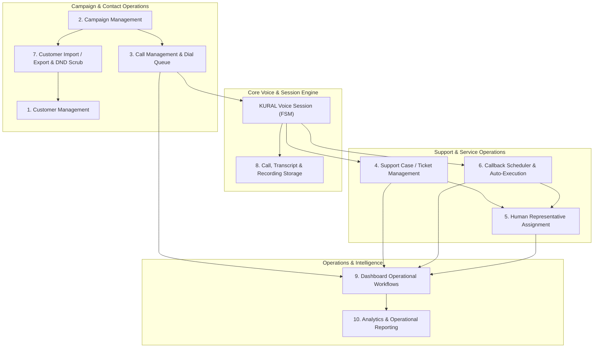
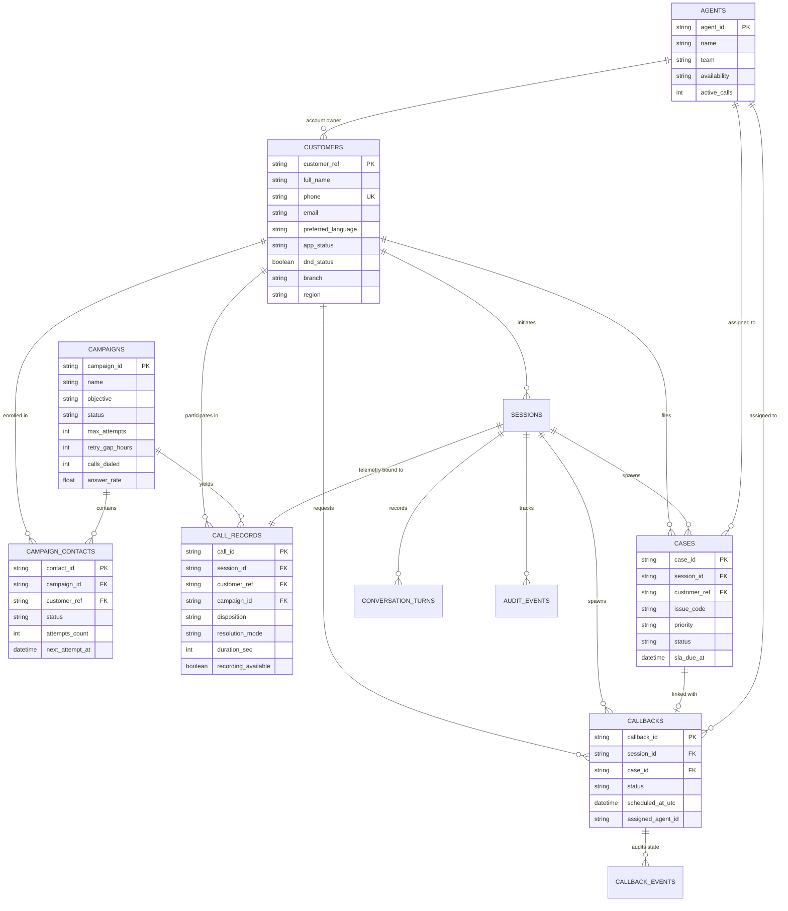
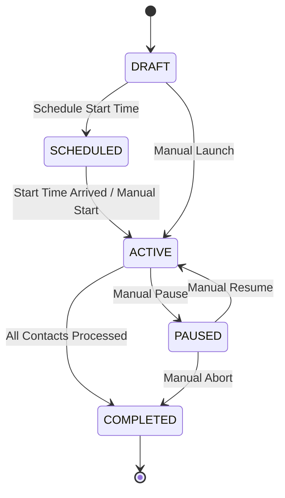
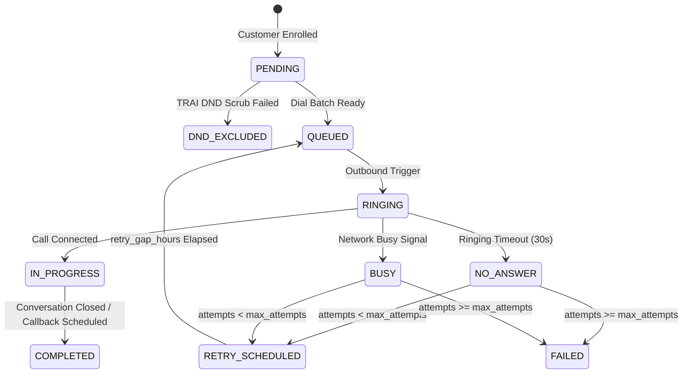
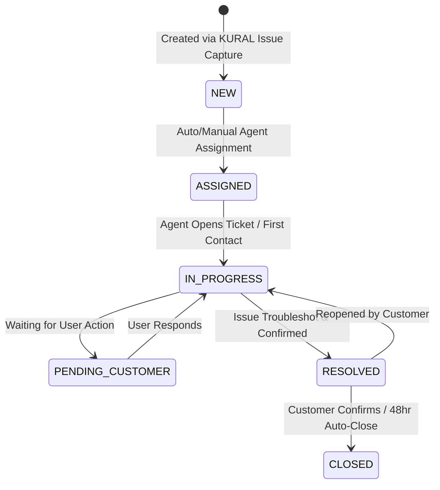
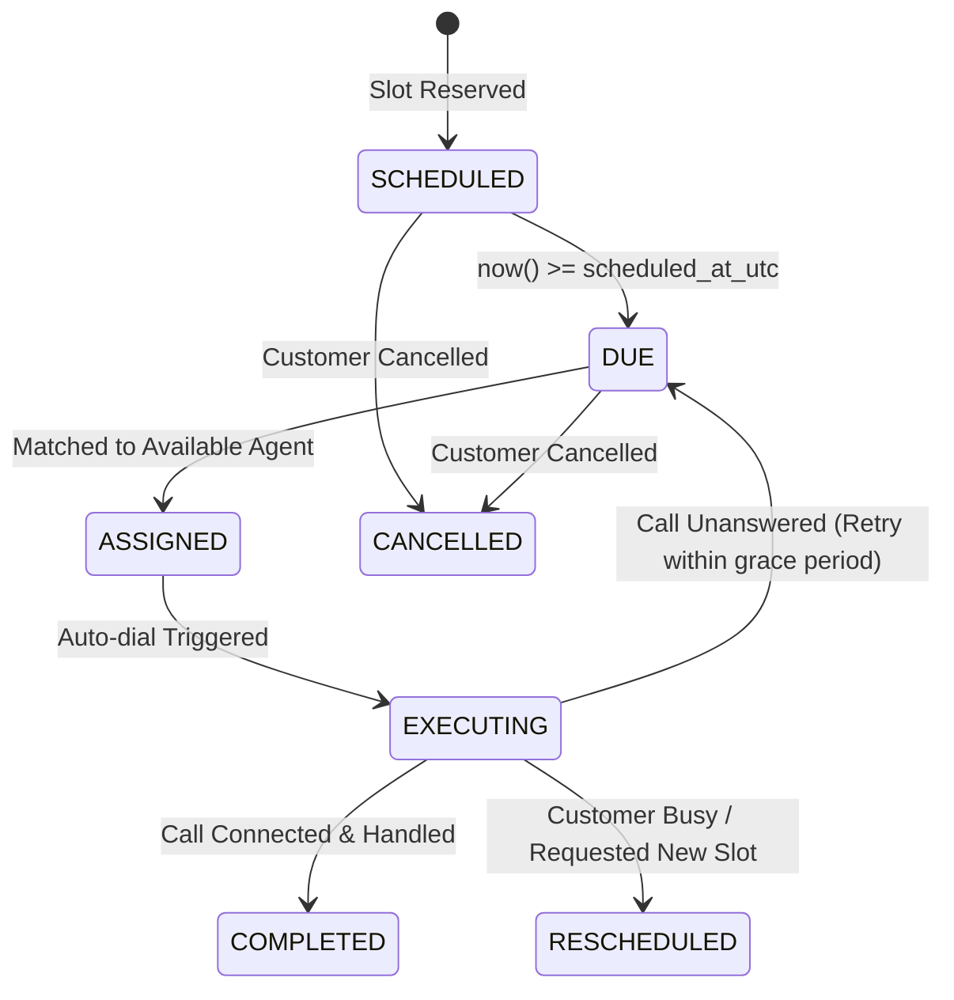

# AVA — Phase 3 Architectural Specification & Technical Design
## Bank Operations & Automation

**Document Version:** 1.0.0  
**Status:** PROPOSED — PENDING APPROVAL  
**Author:** Principal Voice AI Architect & Production Systems Engineer  
**Baseline Git Tag:** `phase2-accepted-frozen` (151/151 tests passing)  

---

## 1. Executive Summary & Architectural Principles

Phase 3 transitions AVA from a validated voice conversational agent into a fully operational banking operations and campaign management platform for Indian retail banking.

### Fixed Architectural Invariants
1. **KURAL Sole State & Policy Authority:** KURAL deterministic FSM remains the exclusive authority over dialogue states, transitions, customer intent resolution, safety gates, and action authorizations. The LLM remains an auxiliary intelligence layer.
2. **Provider-Agnostic LLM Interface:** The LLM abstraction layer preserves interchangeability across Qwen 3.8 27B, Groq `openai/gpt-oss-20b`, and Gemini 3.8 Flash without tight coupling.
3. **Voice Engine Stability:** Sarvam Saaras v4 STT, Sarvam Bulbul v3 TTS, and the existing PCM WebSocket realtime orchestrator remain intact.
4. **Zero Heavy Infrastructure Overhead:** No Redis, no Celery, no RabbitMQ, no vector databases, no microservices, and no third-party telephony brokers at this stage.
5. **In-Process Concurrency & Persistence:** All queuing, campaign dial loops, and callback triggers operate via robust `asyncio` background tasks inside FastAPI's lifespan lifecycle, backed by SQLite ACID transactions.
6. **Zero Regression Guarantee:** All 151 Phase 1 and Phase 2 tests must remain completely green throughout Phase 3 implementation.

---

## 2. Target Domains Overview

Phase 3 implements exactly the 10 operational domains specified by bank operations:



---

## 3. Database Entities & Schema Design

To support all 10 domains while maintaining backward compatibility with existing `sessions`, `conversation_turns`, `cases`, `callbacks`, `callback_events`, `outbox`, and `audit_events`, Phase 3 introduces four new core tables and augments existing records.

### 3.1 New Entities

#### 1. `customers` (`CustomerRow`)
The master customer registry for banking contacts, DND status, and account relationships.
```python
class CustomerRow(Base):
    __tablename__ = "customers"

    customer_ref: Mapped[str] = mapped_column(String(64), primary_key=True)
    full_name: Mapped[str] = mapped_column(String(128), nullable=False)
    phone: Mapped[str] = mapped_column(String(20), unique=True, index=True, nullable=False)
    email: Mapped[str | None] = mapped_column(String(128), nullable=True)
    preferred_language: Mapped[str] = mapped_column(String(20), default="Hindi", nullable=False)
    app_status: Mapped[str] = mapped_column(String(30), default="NOT_INSTALLED", nullable=False) # INSTALLED, OUTDATED, NOT_INSTALLED
    app_version: Mapped[str | None] = mapped_column(String(20), nullable=True)
    dnd_status: Mapped[bool] = mapped_column(Boolean, default=False, nullable=False) # TRAI DND Registry scrub
    account_type: Mapped[str] = mapped_column(String(40), default="SAVINGS", nullable=False)
    branch: Mapped[str] = mapped_column(String(80), default="Mumbai Metro", nullable=False)
    region: Mapped[str] = mapped_column(String(40), default="West", nullable=False)
    assigned_agent_id: Mapped[str | None] = mapped_column(ForeignKey("agents.agent_id", ondelete="SET NULL"), nullable=True)
    created_at: Mapped[datetime] = mapped_column(UTCDateTime(), default=utcnow, nullable=False)
    updated_at: Mapped[datetime] = mapped_column(UTCDateTime(), default=utcnow, onupdate=utcnow, nullable=False)
```

#### 2. `campaigns` (`CampaignRow`)
Defines outbound campaigns, calling objectives, pacing, retry rules, and regional scope.
```python
class CampaignRow(Base):
    __tablename__ = "campaigns"

    campaign_id: Mapped[str] = mapped_column(String(40), primary_key=True, default=lambda: f"CMP-{uuid4().hex[:8].upper()}")
    name: Mapped[str] = mapped_column(String(128), nullable=False)
    objective: Mapped[str] = mapped_column(String(80), default="App adoption", nullable=False)
    status: Mapped[str] = mapped_column(String(20), default="DRAFT", nullable=False) # DRAFT, SCHEDULED, ACTIVE, PAUSED, COMPLETED
    script_version: Mapped[str] = mapped_column(String(20), default="v1.0", nullable=False)
    segment_size: Mapped[int] = mapped_column(Integer, default=0, nullable=False)
    max_attempts: Mapped[int] = mapped_column(Integer, default=3, nullable=False)
    retry_gap_hours: Mapped[int] = mapped_column(Integer, default=24, nullable=False)
    languages_json: Mapped[list[str]] = mapped_column("languages", JSON, default=lambda: ["Hindi", "English"], nullable=False)
    region: Mapped[str] = mapped_column(String(60), default="All India", nullable=False)
    calls_dialed: Mapped[int] = mapped_column(Integer, default=0, nullable=False)
    answer_rate: Mapped[float] = mapped_column(Float, default=0.0, nullable=False)
    created_at: Mapped[datetime] = mapped_column(UTCDateTime(), default=utcnow, nullable=False)
    updated_at: Mapped[datetime] = mapped_column(UTCDateTime(), default=utcnow, onupdate=utcnow, nullable=False)
```

#### 3. `campaign_contacts` (`CampaignContactRow`)
The dialable queue per campaign contact, tracking attempts, dispositions, and retry schedules.
```python
class CampaignContactRow(Base):
    __tablename__ = "campaign_contacts"
    __table_args__ = (
        UniqueConstraint("campaign_id", "customer_ref", name="uq_campaign_customer"),
        Index("ix_campaign_dial_queue", "campaign_id", "status", "next_attempt_at"),
    )

    contact_id: Mapped[str] = mapped_column(String(40), primary_key=True, default=lambda: f"CNT-{uuid4().hex[:8].upper()}")
    campaign_id: Mapped[str] = mapped_column(ForeignKey("campaigns.campaign_id", ondelete="CASCADE"), nullable=False, index=True)
    customer_ref: Mapped[str] = mapped_column(ForeignKey("customers.customer_ref", ondelete="CASCADE"), nullable=False, index=True)
    phone: Mapped[str] = mapped_column(String(20), nullable=False)
    status: Mapped[str] = mapped_column(String(30), default="PENDING", nullable=False) # PENDING, QUEUED, RINGING, IN_PROGRESS, COMPLETED, RETRY_SCHEDULED, FAILED, DND_EXCLUDED
    attempts_count: Mapped[int] = mapped_column(Integer, default=0, nullable=False)
    last_attempt_at: Mapped[datetime | None] = mapped_column(UTCDateTime(), nullable=True)
    next_attempt_at: Mapped[datetime | None] = mapped_column(UTCDateTime(), nullable=True)
    last_disposition: Mapped[str | None] = mapped_column(String(40), nullable=True)
    last_session_id: Mapped[str | None] = mapped_column(String(36), nullable=True)
    created_at: Mapped[datetime] = mapped_column(UTCDateTime(), default=utcnow, nullable=False)
    updated_at: Mapped[datetime] = mapped_column(UTCDateTime(), default=utcnow, onupdate=utcnow, nullable=False)
```

#### 4. `call_records` (`CallRecordRow`)
Operational call log binding KURAL sessions with campaign analytics, human handoffs, and audio assets.
```python
class CallRecordRow(Base):
    __tablename__ = "call_records"

    call_id: Mapped[str] = mapped_column(String(40), primary_key=True, default=lambda: f"CALL-{uuid4().hex[:8].upper()}")
    session_id: Mapped[str] = mapped_column(ForeignKey("sessions.session_id", ondelete="CASCADE"), unique=True, nullable=False)
    customer_ref: Mapped[str] = mapped_column(ForeignKey("customers.customer_ref", ondelete="CASCADE"), nullable=False, index=True)
    campaign_id: Mapped[str | None] = mapped_column(ForeignKey("campaigns.campaign_id", ondelete="SET NULL"), nullable=True, index=True)
    campaign_name: Mapped[str] = mapped_column(String(128), default="Inbound / Direct", nullable=False)
    masked_phone: Mapped[str] = mapped_column(String(20), nullable=False)
    language: Mapped[str] = mapped_column(String(20), default="Hindi", nullable=False)
    region: Mapped[str] = mapped_column(String(40), default="West", nullable=False)
    branch: Mapped[str] = mapped_column(String(80), default="Mumbai Metro", nullable=False)
    started_at: Mapped[datetime] = mapped_column(UTCDateTime(), default=utcnow, nullable=False)
    duration_sec: Mapped[int] = mapped_column(Integer, default=0, nullable=False)
    disposition: Mapped[str | None] = mapped_column(String(40), nullable=True) # CLOSED, CALLBACK_SCHEDULED, ESCALATED, NOT_INTERESTED, BUSY, NO_ANSWER, DND, FAILED
    resolution_mode: Mapped[str] = mapped_column(String(20), default="AI", nullable=False) # AI, HUMAN, OPEN
    status: Mapped[str] = mapped_column(String(20), default="IN_PROGRESS", nullable=False) # IN_PROGRESS, COMPLETED
    connected: Mapped[bool] = mapped_column(Boolean, default=True, nullable=False)
    consented: Mapped[bool] = mapped_column(Boolean, default=True, nullable=False)
    app_installed: Mapped[bool] = mapped_column(Boolean, default=False, nullable=False)
    app_updated: Mapped[bool] = mapped_column(Boolean, default=False, nullable=False)
    app_version: Mapped[str] = mapped_column(String(20), default="—", nullable=False)
    sentiment: Mapped[float] = mapped_column(Float, default=0.0, nullable=False)
    issue_category: Mapped[str | None] = mapped_column(String(60), nullable=True)
    callback_id: Mapped[str | None] = mapped_column(String(40), nullable=True)
    escalation_id: Mapped[str | None] = mapped_column(String(40), nullable=True)
    kural_state: Mapped[str] = mapped_column(String(40), default="READY", nullable=False)
    intent: Mapped[str] = mapped_column(String(40), default="UNKNOWN", nullable=False)
    policy_decision: Mapped[str] = mapped_column(String(20), default="ALLOWED", nullable=False)
    cost_inr: Mapped[float] = mapped_column(Float, default=0.50, nullable=False)
    compliance_flags_json: Mapped[list[str]] = mapped_column("compliance_flags", JSON, default=list, nullable=False)
    feature_interest_json: Mapped[list[str]] = mapped_column("feature_interest", JSON, default=list, nullable=False)
    summary: Mapped[str] = mapped_column(Text, default="", nullable=False)
    recording_available: Mapped[bool] = mapped_column(Boolean, default=False, nullable=False)
    recording_path: Mapped[str | None] = mapped_column(String(255), nullable=True)
    created_at: Mapped[datetime] = mapped_column(UTCDateTime(), default=utcnow, nullable=False)
```

#### 5. `agents` (`AgentRow`)
Represents human representatives available for live warm handoff and case assignment.
```python
class AgentRow(Base):
    __tablename__ = "agents"

    agent_id: Mapped[str] = mapped_column(String(40), primary_key=True)
    name: Mapped[str] = mapped_column(String(128), nullable=False)
    team: Mapped[str] = mapped_column(String(80), nullable=False) # Digital support · North, Digital support · South
    languages_json: Mapped[list[str]] = mapped_column("languages", JSON, default=lambda: ["Hindi", "English"], nullable=False)
    availability: Mapped[str] = mapped_column(String(20), default="AVAILABLE", nullable=False) # AVAILABLE, ON_CALL, BREAK, OFFLINE
    active_calls: Mapped[int] = mapped_column(Integer, default=0, nullable=False)
    handled_today: Mapped[int] = mapped_column(Integer, default=0, nullable=False)
    avg_resolution_min: Mapped[int] = mapped_column(Integer, default=10, nullable=False)
    sla_hit_percent: Mapped[int] = mapped_column(Integer, default=95, nullable=False)
    skills_json: Mapped[list[str]] = mapped_column("skills", JSON, default=lambda: ["APP_SUPPORT", "GENERAL_SUPPORT"], nullable=False)
    created_at: Mapped[datetime] = mapped_column(UTCDateTime(), default=utcnow, nullable=False)
    updated_at: Mapped[datetime] = mapped_column(UTCDateTime(), default=utcnow, onupdate=utcnow, nullable=False)
```

#### 6. `report_schedules` (`ReportScheduleRow`)
Persists automated operational report configurations.
```python
class ReportScheduleRow(Base):
    __tablename__ = "report_schedules"

    schedule_id: Mapped[str] = mapped_column(String(40), primary_key=True, default=lambda: f"SCH-{uuid4().hex[:8].upper()}")
    cadence: Mapped[str] = mapped_column(String(20), default="DAILY", nullable=False)
    time_of_day: Mapped[str] = mapped_column(String(10), default="08:00", nullable=False)
    formats_json: Mapped[list[str]] = mapped_column("formats", JSON, default=lambda: ["PDF", "XLSX"], nullable=False)
    recipient: Mapped[str] = mapped_column(String(128), nullable=False)
    enabled: Mapped[bool] = mapped_column(Boolean, default=True, nullable=False)
    demo_only: Mapped[bool] = mapped_column(Boolean, default=True, nullable=False)
    created_at: Mapped[datetime] = mapped_column(UTCDateTime(), default=utcnow, nullable=False)
```

---

## 4. Entity-Relationship Diagram (ERD)



---

## 5. Operational State Machines

All Phase 3 entities adhere to strictly deterministic state transitions enforced in their respective domain services.

### 5.1 Campaign Lifecycle


### 5.2 Campaign Contact Dialing Lifecycle


### 5.3 Support Case / Escalation Lifecycle


### 5.4 Callback Execution Lifecycle


---

## 6. Comprehensive REST API Specifications

The Phase 3 backend expands `kural.api.dashboard_router` and domain routers to serve both the frontend dashboard in live mode (`liveApi`) and external banking integrations.

| Method | Endpoint | Description | Query / Body Parameters | Response Status |
| :--- | :--- | :--- | :--- | :--- |
| **GET** | `/api/snapshot` | Combined dashboard snapshot | none | `200 OK` (DashboardSnapshot) |
| **GET** | `/api/customers` | Paginated customer search | `search, app_status, dnd, limit, offset` | `200 OK` (list[CustomerRecord]) |
| **POST** | `/api/customers` | Register customer | `CustomerCreatePayload` | `201 Created` |
| **GET** | `/api/customers/{customer_ref}` | Fetch customer detail & history | none | `200 OK` / `404` |
| **POST** | `/api/customers/import` | Bulk CSV import with DND scrub | `multipart/form-data (file: CSV)` | `200 OK` (ImportSummary) |
| **GET** | `/api/customers/export` | Stream customer CSV export | `format=csv` | `200 OK` (text/csv) |
| **GET** | `/api/campaigns` | List all campaigns | `status, region` | `200 OK` (list[Campaign]) |
| **POST** | `/api/campaigns` | Create new campaign | `CampaignCreatePayload` | `201 Created` |
| **GET** | `/api/campaigns/{id}` | Campaign details with pacing stats | none | `200 OK` / `404` |
| **PATCH**| `/api/campaigns/{id}` | Update campaign configuration | `Partial<Campaign>` | `200 OK` |
| **POST** | `/api/campaigns/{id}/start` | Activate campaign dialing | none | `200 OK` |
| **POST** | `/api/campaigns/{id}/pause` | Pause active campaign | none | `200 OK` |
| **POST** | `/api/campaigns/{id}/contacts/import` | Bulk add contacts to campaign | `multipart/form-data (file: CSV)` | `200 OK` |
| **GET** | `/api/calls` | Filterable call history | `campaign_id, disposition, range, limit` | `200 OK` (list[CallRecord]) |
| **GET** | `/api/calls/{call_id}` | Full call detail with turns | none | `200 OK` / `404` |
| **GET** | `/api/calls/{call_id}/transcript` | PII-redacted call transcript | none | `200 OK` (list[TranscriptMessage]) |
| **GET** | `/api/calls/{call_id}/recording` | Stream WAV recording | none | `200 OK` (audio/wav) / `404` |
| **GET** | `/api/escalations` / `/cases` | List support cases | `status, priority, assigned_agent_id` | `200 OK` (list[EscalationCase]) |
| **GET** | `/api/escalations/{id}` | Support case details | none | `200 OK` / `404` |
| **POST** | `/api/escalations` / `/cases` | Create support case | `CaseCreatePayload` | `201 Created` |
| **PATCH**| `/api/escalations/{id}` | Update case status / notes / agent | `Partial<EscalationCase>` | `200 OK` |
| **GET** | `/api/agents` | Representative roster & workloads | `availability, team` | `200 OK` ({agents, workloads}) |
| **PATCH**| `/api/agents/{id}/status` | Update agent availability | `availability: AgentAvailability` | `200 OK` |
| **POST** | `/api/agents/assign` | Smart auto-assign ticket/callback | `{resource_type, resource_id}` | `200 OK` |
| **GET** | `/api/callbacks` | List scheduled & due callbacks | `status, session_id` | `200 OK` (list[Callback]) |
| **POST** | `/api/callbacks` | Create/reschedule callback | `CallbackDraft` | `201 Created` |
| **PATCH**| `/api/callbacks/{id}` | Reschedule or cancel callback | `Partial<Callback>` | `200 OK` |
| **POST** | `/api/callbacks/{id}/execute`| Manually execute/dial callback | none | `200 OK` |
| **GET** | `/api/compliance/summary` | Consent audit & egress stats | none | `200 OK` ({consents, egressLogs}) |
| **GET** | `/api/audit` | Filterable audit trails | `role, resource_type, limit` | `200 OK` (list[AuditEvent]) |
| **POST** | `/api/audit` | Record audit entry | `AuditCreatePayload` | `201 Created` |
| **GET** | `/api/reports/kpi-summary` | Aggregated KPI metrics | `range, campaign_id` | `200 OK` (KpiSummary) |
| **GET** | `/api/reports/schedules` | Automated report schedules | none | `200 OK` (list[ReportSchedule]) |
| **POST** | `/api/reports/schedules` | Create automated report schedule | `ReportSchedule` | `201 Created` |

---

## 7. In-Process Background Automation Architecture

Without introducing external message brokers (Redis, Celery), background automation is orchestrated directly within FastAPI's lifespan using structured, non-blocking `asyncio` worker tasks.

### 7.1 Lifespan Background Workers
1. **Callback Scheduler Worker:**
   - Polls every 15 seconds.
   - Detects `CallbackRow` where `status == 'SCHEDULED'` and `scheduled_at_utc <= now()`.
   - Transitions status to `DUE`.
   - Triggers `event_bus.publish("callback_due", {"callback_id": id})`.
2. **Campaign Pacing & Dial Dispatcher Worker:**
   - Polls every 5 seconds for `CampaignRow` with `status == 'ACTIVE'`.
   - Enforces a concurrency cap (e.g. max 5 simultaneous simulated outbound calls per campaign).
   - Fetches batch of `CampaignContactRow` where `status == 'QUEUED'` or `status == 'RETRY_SCHEDULED' and next_attempt_at <= now()`.
   - Transitions contact to `RINGING`, creates `SessionRow` and `CallRecordRow`.
   - Emits real-time progress events over WebSocket / SSE.
3. **Transaction Safety & Crash Isolation:**
   - Each polling iteration runs in an isolated database session with explicit commit and rollback guards.
   - Any worker exception is logged, caught, and backoff-delayed without crashing the parent process or blocking other workers.

---

## 8. Human Representative Assignment & Warm Handoff

When a customer requests human assistance or reports an unresolvable technical issue, AVA coordinates a structured handoff.

### 8.1 Assignment Scoring Algorithm
When assigning a case or callback, the matching engine computes an agent score based on:
1. **Language Compatibility (+40 pts):** Agent speaks customer's preferred language.
2. **Skill / Taxonomy Match (+30 pts):** Agent team matches the issue category (e.g. `APP_SUPPORT` vs `SECURITY_DESK`).
3. **Current Availability (+20 pts):** Agent is currently `AVAILABLE` (vs `ON_CALL` or `BREAK`).
4. **Workload Balancing (up to +10 pts):** Inverse weighting of currently active tickets and overdue SLAs.

### 8.2 Live Warm-Transfer Context Package
Upon handoff, the system compiles a structured handoff payload transferred to the assigned representative's workspace:
- `customer_ref`, masked phone, customer name, branch.
- Customer app version, installation state, device OS.
- Verbatim customer issue summary and extracted key quotes.
- Actions already tried during the automated voice conversation.
- Sanitized, turn-by-turn conversation transcript with PII redactions.
- Direct link to session recording.

---

## 9. Call Recording, Transcript & Telemetry Storage

### 9.1 Local Storage Layout
Audio recordings and session artifacts are organized deterministically under a dedicated local directory:
```
storage/
  recordings/
    {YYYY-MM-DD}/
      {session_id}.wav
  transcripts/
    {YYYY-MM-DD}/
      {session_id}.json
  exports/
    temp_export_{uuid}.csv
```

### 9.2 PII Redaction Policy
Transcripts served via `/api/calls/{call_id}/transcript` or exported to operations dashboards undergo regex and token-based redaction:
- 10-digit phone numbers: `+91 98XXX XX123`
- 16-digit debit/credit card numbers: `XXXX-XXXX-XXXX-1234`
- 6-digit OTPs / PINs: `[OTP REDACTED]`
- Aadhaar numbers (12-digit): `XXXX-XXXX-1234`

### 9.3 WAV Audio Delivery
- Endpoints implement HTTP `Range` requests and chunked streaming for audio playback in standard browser `<audio>` players.
- In prototype/demo mode where microphone audio was streamed as PCM chunks during the call, the orchestrator flushes the accumulated 16kHz PCM buffer into a compliant RIFF/WAV file upon session closure.

---

## 10. Customer Import / Export & Scrubbing Pipeline

### 10.1 Bulk CSV Import Rules
Outbound campaign dial lists and customer registries can be imported via `/api/customers/import` or `/api/campaigns/{id}/contacts/import`.

Validation Pipeline:
1. **Header Validation:** Requires `full_name`, `phone`, `preferred_language`. Optional: `email`, `app_status`, `branch`, `region`.
2. **Phone Number Normalization:**
   - Cleans spaces, dashes, parentheses.
   - Accepts 10-digit Indian numbers (`9876543210`) and standardizes to E.164 (`+919876543210`).
   - Rejects numbers failing Indian mobile numbering plans (must start with 6, 7, 8, or 9).
3. **TRAI National Do-Not-Disturb (DND) Scrub:**
   - If contact is marked DND in registry, contact status is flagged `DND_EXCLUDED`.
   - DND contacts are prevented from entering the campaign dial queue.
4. **Deduplication:**
   - If `phone` already exists, update customer details or link to campaign without duplicating records.
5. **Error Reporting:**
   - Returns structured JSON report detailing `total_rows`, `imported_count`, `skipped_count`, and `errors: list[{row, reason}]`.

---

## 11. Dashboard Operational Integration

The frontend currently operates in `mock` mode using `mockSnapshot` from localStorage. Phase 3 unifies the frontend with live backend endpoints:

1. **Dashboard API Switch:**
   - Updating `frontend/src/services/dashboardApi.ts` mode to hit live backend endpoints (`/api/calls`, `/api/campaigns`, `/api/callbacks`, `/api/escalations`, `/api/agents`, etc.).
   - Maintaining seamless fallback to mock data if the backend server is unreachable.
2. **Real-time Event Streaming:**
   - SSE endpoint `/api/events/sse` emits instant UI updates when:
     - New voice call connects or completes.
     - Support ticket is created or escalated.
     - Callback becomes due.
     - Campaign progress increments.
3. **Role-Based Audit Logging:**
   - All operational actions taken via the dashboard (status updates, case reassignments, campaign pauses) are recorded in `audit_events` with the authenticated actor role (`OPS_MANAGER`, `SUPERVISOR`, `AGENT`, `COMPLIANCE`).

---

## 12. Analytics, KPIs & Reporting

### 12.1 KPI Calculation Logic
The KPI summary service computes live metrics dynamically:
- **Calls Dialed:** Total outbound attempts initiated.
- **Answer Rate:** `(connected_calls / total_calls_dialed) * 100`
- **First-Contact SLA Hit %:** Percentage of escalations contacted within policy window (15m for Urgent, 60m for High, 240m for Normal).
- **Resolution SLA Hit %:** Percentage of cases resolved within SLA window.
- **Cost Analysis:** Average cost per call based on telephony minutes and LLM token usage (target: $\le$ ₹0.85 per call).

---

## 13. Test Plan & Rollback Strategy

### 13.1 Preservation of Existing Tests
- All **151 existing tests** in `tests/` must run and pass unconditionally after every change.
- New database tables will not break existing foreign key constraints on `sessions`, `cases`, or `callbacks`.

### 13.2 Phase 3 Test Matrix
1. **Unit Tests (`tests/test_phase3_models.py`):**
   - Creation and relationships of `CustomerRow`, `CampaignRow`, `CampaignContactRow`, `CallRecordRow`, `AgentRow`, `ReportScheduleRow`.
2. **Domain Service Tests (`tests/test_phase3_services.py`):**
   - Campaign state transitions and contact retry scheduling.
   - Agent matching and skill-based assignment algorithm.
   - PII redaction engine on various phone, card, and OTP patterns.
   - CSV customer import parser and phone normalization.
3. **API Integration Tests (`tests/test_phase3_api.py`):**
   - Endpoints `/api/campaigns`, `/api/customers`, `/api/calls`, `/api/agents`, `/api/reports/kpi-summary`.
   - Streaming endpoints for CSV exports and WAV audio playback.
4. **End-to-End Simulation Test (`tests/test_phase3_e2e_operations.py`):**
   - Full flow: Customer imported $\to$ Campaign created $\to$ Call dialed $\to$ Session turn executed $\to$ Issue captured $\to$ Case created $\to$ Agent assigned $\to$ Callback scheduled $\to$ Callback executed.

### 13.3 Rollback Strategy
- The Git commit `24ec5e0` is tagged `phase2-accepted-frozen`.
- Any unexpected defect or architectural deviation can be reverted cleanly to the frozen tag.
